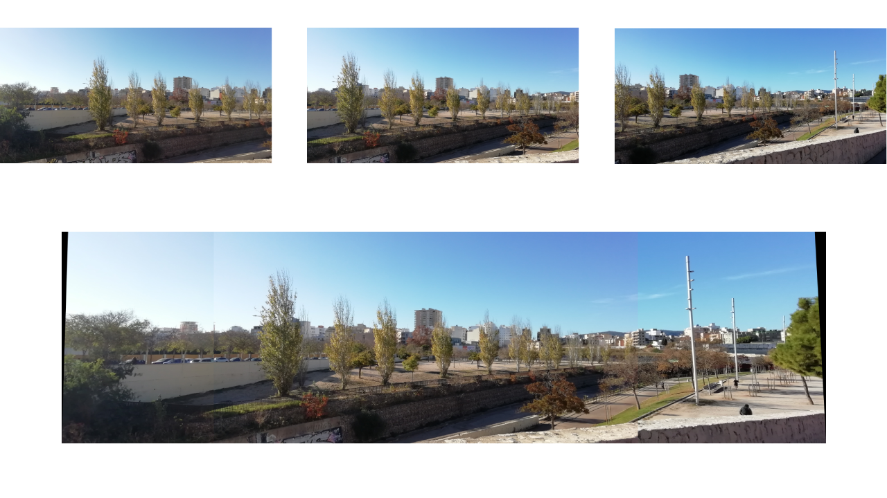

# Panoramic-Image-Creator
This project is about the development of an algorithm for creating panoramic views from sequential images using computer vision techniques such as keypoints extraction, matching, and image alignment. The algorithm aims to merge images while overcoming challenges in scale, rotation, and lighting variations. It is implemented by using Python along with OpenCV and NumPy.


## Requirements
- Python 3.9.6
- opencv-contrib-python 4.5.1.48
- numpy 1.26.1
- matplotlib-base 3.4.2 (only for plotting the result)

# How to use it

An example has been provided in the `src/` folder, in which you can
fill it up with your own images paths and provide the corresponding image list
to the function.

In order to use the implemented function, first, you will need to read your images and store them in variables. Then, call
`computePanoramicView`, providing a list with the images read
ordered sequentally from left to right. You will need also to import the
`panoramic.py` file where the implementation is located. As follows:

```python
import cv2
from panoramic import computePanoramicView

# Read the images
# img1 = cv2.imread('img_file.png')
# img2 = cv2.imread('...')
# ...
# img5 = cv2.imread('...')

result = computePanoramicView([img1,img2,img3,img4,img5])
```

The result variable will be the panoramic view image constructed. You can pass a list of $n$ images it is not restricted to five. For further information about the approach, optional arguments and return value, see the header comment section above the function definition in the source file `src/panoramic.py`.


# Algorithm constraints

- **Sequential Images**: the images have to be sequential, otherwise probably the matches found will be false matches.

- **Order importance**: not only have to be sequential, but also go from left to right in the list that has to be delivered to the function: `list[0]` will be the leftmost image (in the real scenario) and `list[len(list) - 1]` will be the rightmost image.

- **Shared elements within adjacent images**: between two adjacent images in the list must be shared
elements: a tree, a rock, a field, building, etc. If not, it will be impossible to find true matches between
the two adjacent images.


- **Planar transformation Assumption**: the accuracy of image alignment using homography depends on
the assumption that the scene undergoes planar transformations. This constraints the use of the algorithm
in non-planar or complex 3D scenes. For instance, if the user takes photos changing dramatically in position
and orientation, the algorithm's accuracy may be affected drastically.

- **Static scene**: the algorithm success is tied on the assumption of a static scene. The presence of moving
elements such as people, cars, or big objects can significantly impact correct keypoint matching. Dynamic
elements introduce variations in the scene between consecutive images, leading to mismatches in keypoints
during feature extraction and compromising the accuracy of subsequent steps. Nevertheless, it could work fine in some dynamic scenarios.


# Output Example
Here, you can see one possible outcome of the algorithm (using the default values for the optional parameters). The top 3 images belong to the input, and bottom image is the output result.




# Analysis
For further analysis of the algorithm, please refer to the `report.pdf`. This document was the report I submitted for the final assignment of a Computer Vision course. Within it, you will find:

- An explanation, breakdown and diagram of the algorithm.

- The technologies used.

- Experimentation with the tuneable parameters: image scale factor, percentages of keypoint matches, RANSAC reprojection error, hard illumination variance resiliance, and more.

- Potential improvements.

# Note
By using the algorithm, you may notice visible boundaries between stitched images in the panoramic result. This is particularly noticeable on mobile phones and is caused by slight variations in the amount of light hitting the camera sensor during recording. As a result, ISO and other camera configurations adjust automatically when this option is activated, leading to more pronounced changes in illumination and colors between sequential images.


# References

[1] P. Premsingh, Image stitching using opencv — a step-by-step tutorial.  https://medium.com/@paulsonpremsingh7/image-stitching-using-opencv-a-step-by-step-tutorial-9214aa4255ec

[2] D. Tyagi, Introduction to feature detection and matching.
https://medium.com/@deepanshut041/introduction-to-feature-detection-and-matching-65e27179885d.

[3] D. Tyagi, Introduction to sift( scale invariant feature transform). https://medium.com/@deepanshut041/introduction-to-sift-scale-invariant-feature-transform-65d7f3a72d40.

